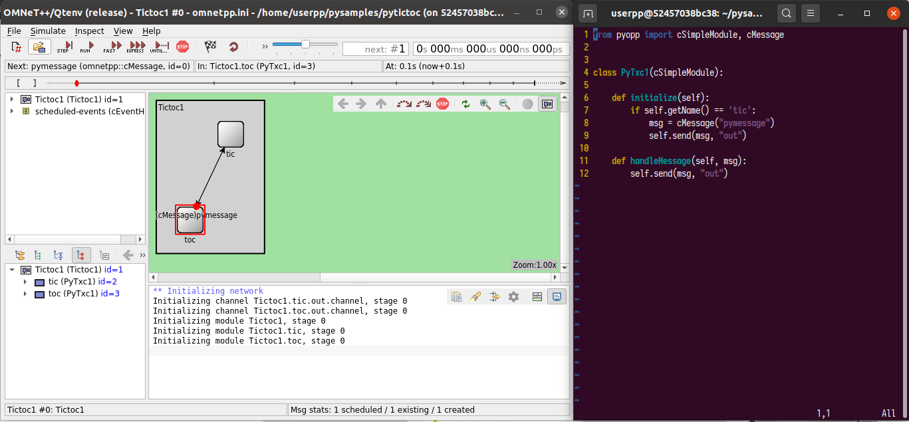

# omnetpy

[OMNeT++](https://omnetpp.org/) meets python



## What does this repository provide?

**TL;DR**: implement OMNeT++ simulations using python programming language:

- no need to know C++
- all the power of python is suddenly available
- faster prototypes
- even using the OMNeT++ IDE (if you wish...)

**Ok, I'm in... tell me more...**:

Leveraging some design decitions made in the original project, it is possible to have OMNeT++
launch a python interpreter and instanciate classes you wrote in python, and use them as regular
``cSimpleModule`` subclasses.

The original code for OMNeT++ needs no change. This repository provides python bindings for C++
APIs (to allow the user subclass ``cSimpleModule`` from python) and some C++ headers to have
OMNeT++ accept this code.

The project is the result of an academic research, see current state and limitations below.

## How can I use it?

Launch a contianer:

```
you@yourmachine$ docker run --rm -ti -e DISPLAY=$DISPLAY -v /tmp/.X11-unix:/tmp/.X11-unix mmodenesi/omnetpy bash
```

On the container, launch the omnetpp IDE:

```
userpp@container$ omnetpp
```

- Follow the [guide](./getstarted) on how to create simulations with python.
- Go [deeper](./advanced).

## Who could be interested in this?

- You want to build simulations using OMNeT++ but your C++ knowledge is weak.
- You want to use OMNeT++ for educational purposes, and your students are more proficient in python than C++.
- You want to prototype a model faster, you can rewrite the code in C++ later.
- You are interested in making changes to the code and being able to use it without any extra compilation steps.

## What is the current state of this project?

- Excepting ``dyna``, all OMNeT++ demostrative samples were successfuly ported to python (see
  [pysamples](./pysamples)), which means it is fairly usable.
- The original goal of the project was to enable python implementation of OMNeT++ simluations,
  which was largely achieved.  For the moment, no further improvements are being implemented
  (automatic bindings generation, QA, docker images for each release of OMNeT++, etc).

## What are the limitations?

- Dynamic deletion of modules is not supported (the ``dyna`` sample could not be ported).
- python code debugging is not supported
- Automatic code generation for messages is not supported (yet, being python so flexible, its not
  missed, either).
- The python bindings were written by hand (an activity that could be automated) and may have mistakes.
- The python bindings were written as needed in order to port the OMNeT++ samples. Not 100% of the
  C++ APIs were ported (though it may be easy to include what is missing).
- This is an academic project. Many things were written "just to make it work" and may not scale well.
- This project was **not** heavily used.
