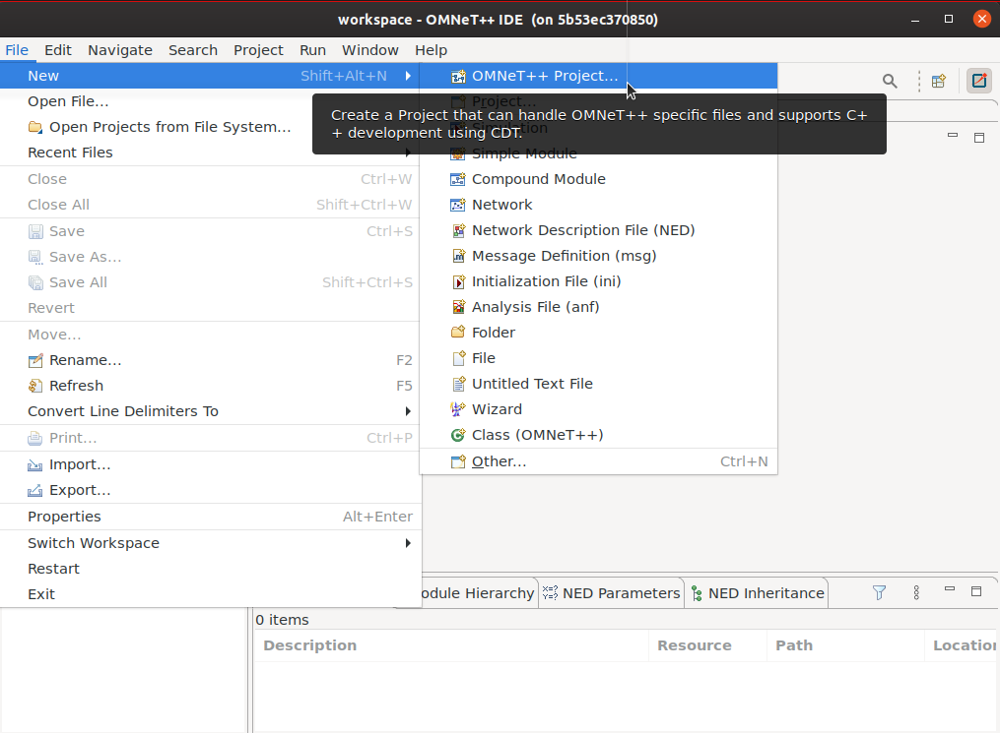
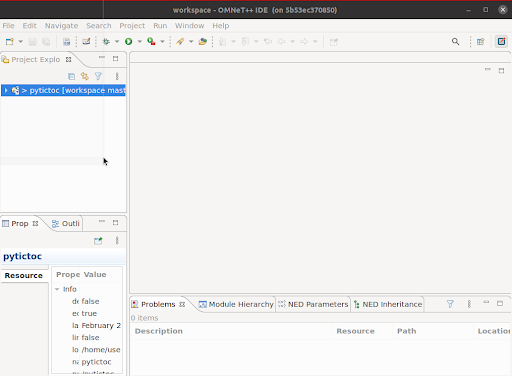
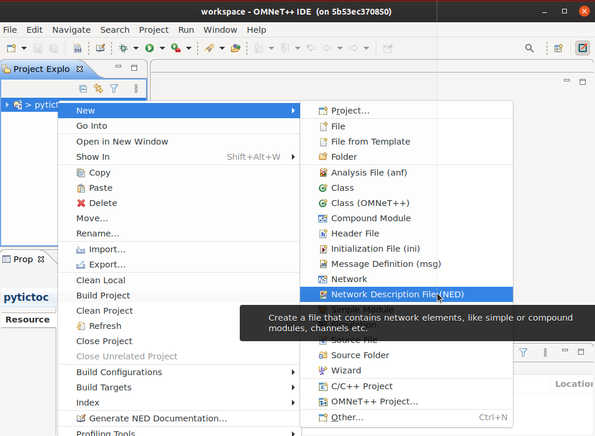
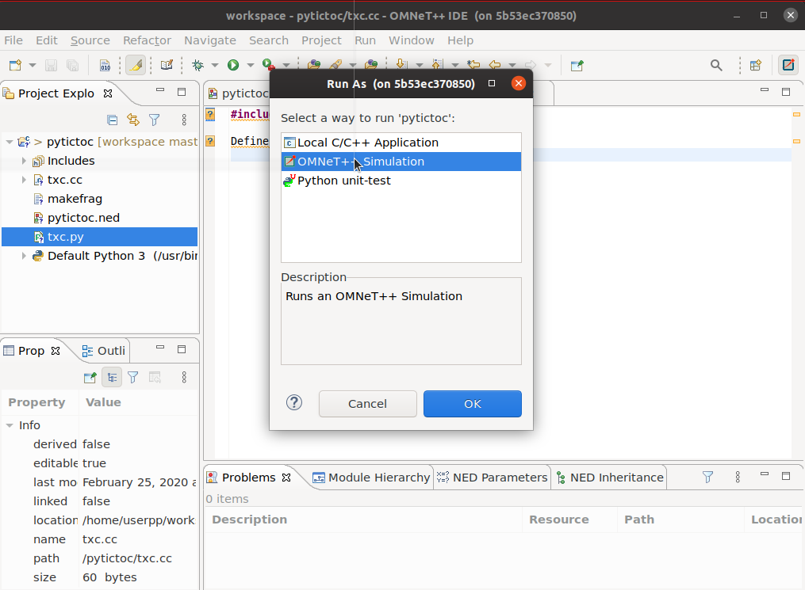

# How to create a simulation using python

This guide will show you how to write the TicToc simulation from the [official
tutorial](https://docs.omnetpp.org/tutorials/tictoc/).

This guide was written and tested using OMNeT++ ``6.0pre8``.

### Prerequisites:

- docker
- linux environment, to launch containers in a graphical environment (only tested in ubuntu).


## Step 1: Launch a container


```
you@yourmachine$ docker run \
    --rm -ti \
    -e DISPLAY=$DISPLAY \
    -v /tmp/.X11-unix:/tmp/.X11-unix mmodenesi/omnetpy:opp-6.0pre8 bash
```

On the container, launch the omnetpp IDE:

```
userpp@container$ omnetpp
```


## Step 2: Prepare a new project

Select _File -> New -> OMNeT++ Project_




On the wizard, insert _pytictoc_ as the name of the project. Select _Empty Project_ and then
_Finish_. You should see a new project on the _projects_ area of the IDE.



## Step 3: Add a NED file

Right click on the project and select _New -> Network Description File (NED)_



Save the file as _pytictoc.ned_ with the following content:

```
simple PyTxc
{
    gates:
        input in;
        output out;
}

//
// Two instances (tic and toc) of Txc1 connected both ways.
// Tic and toc will pass messages to one another.
//
network PyTictoc
{
    submodules:
        tic: PyTxc;
        toc: PyTxc;
    connections:
        tic.out --> {  delay = 100ms; } --> toc.in;
        tic.in <-- {  delay = 100ms; } <-- toc.out;
}
```

## Step 3: Add a C++ file

Right click on the project and select _New -> File_. Save it as _txc.cc_ with the following
content:

```C++
#include <omnetpy.h>

Define_Python_Module("txc", "PyTxc");
```

Given that the IDE does not currently know where to locate that header, it's OK if you see some
error warnings on the editor. In order to get rid of these errors (although it is not needed) you
must navigate to _Project -> Properties -> C/C++ General -> Path and Symbols_ and add
_/home/userpp/omnetpy/include_ to the list of directories.

## Step 4: Add a makefrag file

Right click on the project and select _New -> File_. Save it as _makefrag_ with the following
content:

```make
INCLUDE_PATH += $(shell python3 -m pybind11 --include) -I$(OMNETPY_ROOT)/include
LIBS = -lomnetpy $(shell python3-config --libs | cut -d" " -f1)
LDFLAGS += -L$(OMNETPY_ROOT)/lib
```

**IMPORTANT**: Steps 3 and 4 are all the C++ related stuff you need. Step 3 is telling OMNeT++
that whenever it needs to create an instance of ``PyTxc``, then it should look for it in the file
_tcx.py_ (which we'll create in a moment). Step 4 makes the compilation possible.


## Step 5: Add a python file

Right click on the project and select _New -> File_. Save it as _txc.py_ with the following
content:

```python
from pyopp import cSimpleModule, cMessage


class PyTxc(cSimpleModule):
    def initialize(self):
        if self.getName() == 'tic':
            self.send(cMessage('msg'), 'out')

    def handleMessage(self, msg):
        self.send(msg, 'out')
```

## Step 6: Launch the simulation

On the editor tab, of the IDE select the file _txc.cc_ (the C++ file). Select _Run -> Run_ and
choose _OMNeT++ Simulation_.



After compilation (this is the only time there compilation is required) you should see the
simulation window:


